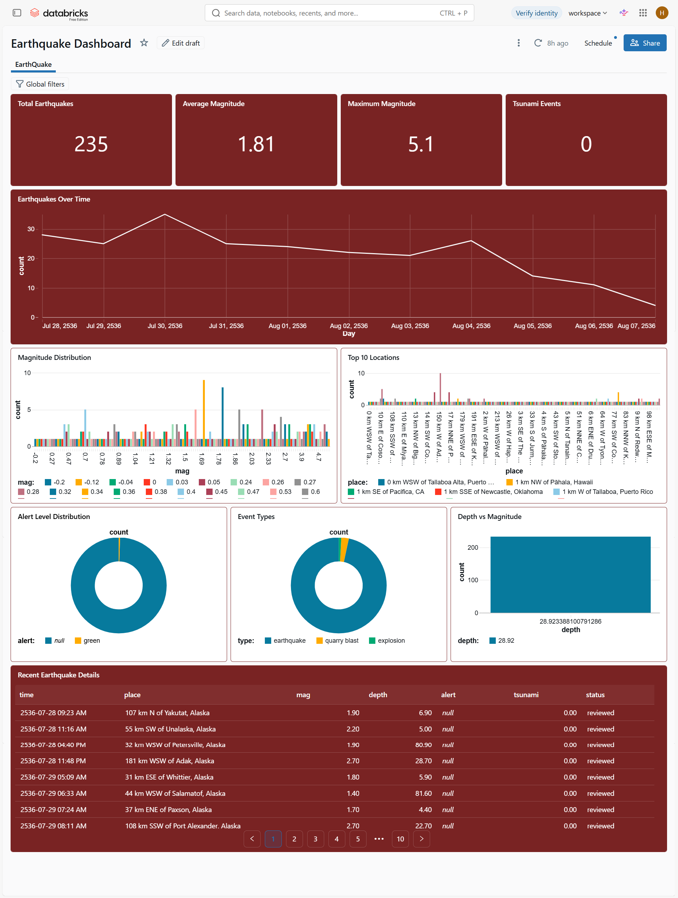

# 🌍 YouTube Earthquake Dashboard

A Databricks-based analytics dashboard for exploring and monitoring earthquake data through interactive KPIs, charts, detailed records, and filters.

The dashboard provides a consolidated view of earthquake activity, magnitude distribution, geographic locations, earthquake depth, tsunami events, and alert levels.


---

## 1. Project Overview

### Purpose

The **YouTube Earthquake Dashboard** is designed to analyze earthquake events and present the information through an interactive Databricks dashboard.

It helps users quickly understand:

* How many earthquakes occurred during the selected period
* The average and maximum earthquake magnitude
* How earthquake activity changes over time
* Where earthquakes are occurring
* How earthquake magnitude is distributed
* Average earthquake depth by alert level
* Which recent earthquakes may require attention
* Whether tsunami events were associated with recorded earthquakes

### Key Business Questions

The dashboard answers questions such as:

1. **How many earthquakes have been recorded?**
2. **What is the average earthquake magnitude?**
3. **What is the maximum recorded magnitude?**
4. **How many tsunami events were reported?**
5. **How has earthquake activity changed over time?**
6. **Which locations have the highest number of earthquake events?**
7. **How are earthquakes distributed across different magnitude levels?**
8. **What is the average earthquake depth for each alert level?**
9. **What are the most recent significant earthquake events?**
10. **How do results change when filtering by date, alert level, or magnitude type?**

---

## 2. Data Sources and ETL

### Dataset

The dashboard uses an earthquake event dataset containing fields related to earthquake location, magnitude, depth, tsunami activity, alert level, and event time.

### Visible Data Fields

The dashboard contains or displays fields including:

| Field     | Description                                       |
| --------- | ------------------------------------------------- |
| `time`    | Date and time of the earthquake                   |
| `place`   | Geographic description of the earthquake location |
| `mag`     | Earthquake magnitude                              |
| `depth`   | Earthquake depth                                  |
| `tsunami` | Indicates tsunami-related activity                |
| `alert`   | Earthquake alert level                            |
| `day`     | Date derived from the earthquake timestamp        |

> **Note:** The exact source dataset URL/name is not visible in the dashboard screenshot.

**Dataset source:** `[ADD DATASET SOURCE / URL]`

### High-Level ETL Process

The expected data pipeline follows these stages:

```text
Source Dataset
      |
      v
Data Ingestion
      |
      v
Raw / Bronze Data
      |
      v
Data Cleaning & Transformation
      |
      v
Curated / Silver Data
      |
      v
Aggregated Analytics
      |
      v
Gold / Dashboard Dataset
      |
      v
Databricks Dashboard
```

### Transformation Steps

Typical transformations include:

* Load earthquake records into Databricks
* Convert the earthquake timestamp into a usable date/time format
* Standardize column names and data types
* Handle missing or null values
* Convert magnitude and depth fields to numeric types
* Convert tsunami indicators into usable analytical values
* Categorize or preserve earthquake alert levels
* Calculate daily earthquake counts
* Calculate average and maximum magnitude
* Calculate earthquake counts by magnitude
* Calculate top earthquake locations
* Calculate average depth by alert level
* Prepare the latest significant earthquake records for the dashboard

### Data Quality Checks

Recommended validation checks include:

* Validate timestamp values
* Validate magnitude values
* Validate depth values
* Check for duplicate earthquake events
* Check missing `place`, `mag`, `depth`, and `alert` values
* Validate tsunami indicator values
* Confirm record counts before and after transformation

---

## 3. Architecture

### Databricks Workspace

The project is designed to run within a Databricks workspace.

Recommended workspace components:

* **Databricks Workspace**
* **Notebooks** for ingestion and transformation
* **Compute / SQL Warehouse** for analytical queries
* **Jobs / Workflows** for scheduled processing
* **Delta tables** for reliable storage
* **Databricks Dashboard** for visualization

> **Implementation details to be added:**
>
> * Workspace name: `[ADD WORKSPACE NAME]`
> * Cluster / SQL Warehouse: `[ADD COMPUTE DETAILS]`
> * Notebook names: `[ADD NOTEBOOK NAMES]`
> * Job name: `[ADD JOB NAME]`

### High-Level Dataflow

```text
                    +----------------------+
                    |   Earthquake Dataset |
                    |   CSV / API / Source |
                    +----------+-----------+
                               |
                               v
                    +----------------------+
                    |   Data Ingestion     |
                    |     Databricks       |
                    +----------+-----------+
                               |
                               v
                    +----------------------+
                    |   Bronze / Raw Data  |
                    |      Delta Table     |
                    +----------+-----------+
                               |
                               v
                    +----------------------+
                    | Cleaning & Transform |
                    |      PySpark / SQL   |
                    +----------+-----------+
                               |
                               v
                    +----------------------+
                    | Silver / Curated Data|
                    |      Delta Table     |
                    +----------+-----------+
                               |
                               v
                    +----------------------+
                    | Aggregations / KPIs  |
                    |      SQL Queries     |
                    +----------+-----------+
                               |
                               v
                    +----------------------+
                    | Gold / Analytics Data|
                    +----------+-----------+
                               |
                               v
                    +----------------------+
                    | Databricks Dashboard |
                    +----------------------+
```

### Recommended Databricks Architecture

```text
Source
  |
  v
Bronze
  |
  v
Silver
  |
  v
Gold
  |
  v
Dashboard
```

This layered approach separates raw data, cleaned data, and business-ready analytical data.

---

## 4. Dashboard Design and Metrics

The dashboard contains several KPI cards, analytical charts, a detailed earthquake table, and interactive filters.

### Dashboard Title

**YouTube EarthQuake Dashboard**

---

### KPI Cards

The dashboard displays four primary KPIs.

#### 1. Total Earthquakes

Displays the total number of earthquake events.

**Example shown:** `502`

#### 2. Average Magnitude

Displays the average earthquake magnitude across the selected data.

**Example shown:** `1.89`

#### 3. Maximum Magnitude

Displays the highest earthquake magnitude in the selected dataset.

**Example shown:** `7.7`

#### 4. Tsunami Events

Displays the number of earthquake events associated with tsunami activity.

**Example shown:** `0`

> KPI values are dynamic and will change when filters are applied.

---

### Earthquakes Over Time

A line chart displays earthquake activity over time.

**Purpose:**

* Identify periods with increased earthquake activity
* Identify trends in event frequency
* Compare earthquake activity across dates

**Visualization:** Line chart

**Primary dimensions:**

* `day`
* Earthquake count / `id`

---

### Earthquake Count by Magnitude

A bar chart displays earthquake events grouped by magnitude.

**Purpose:**

* Understand magnitude distribution
* Identify commonly occurring earthquake magnitudes
* Identify high-magnitude events

**Visualization:** Bar chart

**Primary field:** `mag`

---

### Top 10 Locations

The dashboard displays the top earthquake locations based on recorded events.

**Purpose:**

* Identify areas with frequent earthquake activity
* Compare earthquake activity across locations

**Visualization:** Bar chart

**Primary field:** `place`

---

### Average Depth by Alert Level

A bar chart compares average earthquake depth across alert levels.

**Visible categories include:**

* `null`
* `green`
* `orange`

**Purpose:**

* Compare earthquake depth by alert classification
* Identify differences between alert categories

**Visualization:** Bar chart

**Primary fields:**

* `alert`
* `depth`

---

### Recent Significant Earthquakes

The dashboard provides a detailed table containing recent earthquake events.

Visible columns include:

| Column    | Description          |
| --------- | -------------------- |
| `time`    | Earthquake timestamp |
| `place`   | Earthquake location  |
| `mag`     | Magnitude            |
| `depth`   | Depth                |
| `tsunami` | Tsunami indicator    |
| `alert`   | Alert classification |

The table supports pagination for browsing additional records.

---

### Filters

The dashboard provides three primary filters.

#### Date Range

Allows users to select:

```text
From → To
```

Use this filter to analyze earthquake activity within a specific period.

#### Alert Level

Available selection:

```text
All
```

Users can filter earthquake events according to their alert classification.

#### Magnitude Type

Allows users to filter records based on the available magnitude type.

```text
All
```

> **Note:** The exact available magnitude-type values are not fully visible in the screenshot.

---

## 5. Usage Guide

### Accessing the Dashboard

1. Open the Databricks workspace.
2. Navigate to the relevant dashboard.
3. Open **YouTube EarthQuake Dashboard**.
4. Wait for the dashboard queries to load.
5. Use the filters to explore the earthquake dataset.

### Filtering the Dashboard

#### Filter by Date

Select:

```text
From → To
```

to analyze earthquakes within a specific date range.

#### Filter by Alert Level

Select an alert level or keep the filter as:

```text
All
```

to include all alert classifications.

#### Filter by Magnitude Type

Select a magnitude type or use:

```text
All
```

to include all available types.

### Interpreting the Dashboard

A typical analysis workflow is:

```text
1. Review Total Earthquakes
          ↓
2. Check Average & Maximum Magnitude
          ↓
3. Analyze Earthquake Activity Over Time
          ↓
4. Review Magnitude Distribution
          ↓
5. Identify Top Locations
          ↓
6. Compare Depth by Alert Level
          ↓
7. Review Recent Significant Events
```

---

## 6. Access and Security

The dashboard should use Databricks workspace permissions to control access to data and visualizations.

### Recommended Roles

| Role             | Access                                                 |
| ---------------- | ------------------------------------------------------ |
| Data Engineer    | Develop pipelines, notebooks, and data transformations |
| Data Analyst     | Query curated data and use dashboards                  |
| Dashboard Viewer | View and interact with the dashboard                   |
| Workspace Admin  | Manage workspace, permissions, compute, and jobs       |

### Security Recommendations

* Use role-based access control.
* Restrict access to raw and curated data according to user responsibilities.
* Grant dashboard access only to required users or groups.
* Use Databricks groups instead of assigning permissions individually where possible.
* Protect credentials and API keys using secure secret management.
* Avoid storing credentials directly in notebooks.
* Apply appropriate table and catalog permissions.

### Sharing

The dashboard can be shared with authorized Databricks workspace users.

> **Access configuration:** `[ADD ACTUAL WORKSPACE GROUPS / PERMISSIONS]`

---

## 7. Deployment and Maintenance

### Scheduling

The data pipeline should be scheduled through a Databricks Job or Workflow.

Recommended flow:

```text
Scheduled Job
     |
     v
Ingestion
     |
     v
Transformation
     |
     v
Analytics / Aggregation
     |
     v
Dashboard Data Refresh
```

### Refresh Cadence

The actual refresh schedule is not visible in the dashboard screenshot.

**Refresh frequency:** `[ADD SCHEDULE — e.g. hourly / daily / on-demand]`

### Monitoring

Monitor the following:

* Job execution status
* Pipeline failures
* Data ingestion volume
* Transformation errors
* Data quality issues
* Dashboard query performance
* Compute / SQL Warehouse availability
* Unexpected changes in record counts

### Maintenance Tasks

Regular maintenance should include:

* Review failed jobs
* Validate source data availability
* Check data quality
* Review dashboard performance
* Optimize expensive SQL queries
* Remove unused notebooks and jobs
* Review access permissions
* Update documentation when dashboard metrics change

---

## 8. Limitations and Future Work

### Current Limitations

Based on the dashboard image, the following limitations should be considered:

* The exact source dataset and ingestion mechanism are not shown.
* The dashboard currently focuses primarily on analytical charts and tabular earthquake information.
* Geographic visualization is not currently visible.
* The dashboard does not visibly provide a map-based earthquake distribution.
* The exact alert-level classification logic is not documented in the dashboard.
* Some records contain `null` alert values.
* The displayed dates appear to use an unusual year value such as `2536`, indicating that the timestamp/date formatting should be validated before production use.
* The exact magnitude-type definitions are not visible from the dashboard.

### Future Enhancements

Potential improvements include:

#### 🌎 Interactive Earthquake Map

Add a map showing earthquake locations using:

* Latitude
* Longitude
* Magnitude
* Depth
* Alert level

#### 📈 Advanced Trend Analysis

Add:

* Daily/weekly/monthly trends
* Magnitude trend analysis
* Year-over-year comparisons
* Moving averages

#### 🚨 Alert Monitoring

Add:

* High-magnitude event alerts
* Tsunami alerts
* Critical alert notifications
* Threshold-based monitoring

#### 🤖 AI / ML Enhancements

Potential future features:

* Earthquake activity anomaly detection
* Magnitude prediction experiments
* Location-based risk analysis
* Automated earthquake summaries
* Natural-language dashboard querying

#### ⚡ Performance Improvements

Consider:

* Optimizing Delta tables
* Partitioning where appropriate
* Query optimization
* SQL Warehouse sizing
* Pre-aggregated Gold tables
* Incremental data processing

---

## 9. Appendix

### Glossary

| Term               | Meaning                                                                          |
| ------------------ | -------------------------------------------------------------------------------- |
| **Earthquake**     | Sudden movement of the Earth's crust that releases energy                        |
| **Magnitude**      | Measurement representing the size/energy of an earthquake                        |
| **Depth**          | Distance below the Earth's surface where the earthquake originated               |
| **Tsunami**        | Large sea waves that can result from underwater disturbances such as earthquakes |
| **Alert Level**    | Classification representing the severity/risk associated with an earthquake      |
| **Bronze Layer**   | Raw or minimally processed data                                                  |
| **Silver Layer**   | Cleaned and transformed data                                                     |
| **Gold Layer**     | Business-ready analytical data                                                   |
| **ETL**            | Extract, Transform, Load                                                         |
| **Delta Lake**     | Storage layer commonly used for reliable data processing in Databricks           |
| **Databricks Job** | Scheduled or triggered workflow for executing data-processing tasks              |
| **SQL Warehouse**  | Databricks compute environment optimized for SQL analytics                       |

---

### Project Structure

Recommended repository structure:

```text
Youtube-Earthquake-Dashboard/
│
├── README.md
│
├── notebooks/
│   ├── 01_data_ingestion
│   ├── 02_data_cleaning
│   ├── 03_data_transformation
│   └── 04_dashboard_queries
│
├── sql/
│   ├── kpi_queries.sql
│   ├── trend_analysis.sql
│   ├── magnitude_analysis.sql
│   ├── location_analysis.sql
│   └── alert_depth_analysis.sql
│
├── data/
│   └── README.md
│
├── dashboard/
│   └── README.md
│
└── docs/
    └── architecture.md
```

> Update the structure above to match the actual GitHub repository.

---

### Notebook References

| Notebook                 | Purpose                               |
| ------------------------ | ------------------------------------- |
| `01_data_ingestion`      | Ingest earthquake source data         |
| `02_data_cleaning`       | Clean and validate raw records        |
| `03_data_transformation` | Create curated analytical data        |
| `04_dashboard_queries`   | Prepare dashboard metrics and queries |

> **Actual notebook names:** `[REPLACE WITH YOUR DATABRICKS NOTEBOOK NAMES]`

---

### Dashboard References

**Dashboard:** `YouTube EarthQuake Dashboard`

**Databricks Workspace:** `[ADD WORKSPACE URL]`

**Dashboard URL:** `[ADD DASHBOARD URL]`

**Dataset:** `[ADD DATASET NAME / SOURCE]`

**Job / Workflow:** `[ADD JOB NAME]`

---

## Project Summary

The **YouTube Earthquake Dashboard** demonstrates how Databricks can be used to transform earthquake event data into an interactive analytics solution.

The dashboard combines:

* 📊 KPI monitoring
* 📈 Time-series analysis
* 📉 Magnitude distribution
* 📍 Location analysis
* 🚨 Alert-level analysis
* 🌊 Tsunami monitoring
* 📋 Detailed event-level data
* 🔎 Interactive filtering

It provides a single analytical view for understanding earthquake activity and can serve as a foundation for more advanced real-time monitoring, geospatial analytics, and AI/ML-based earthquake intelligence.
